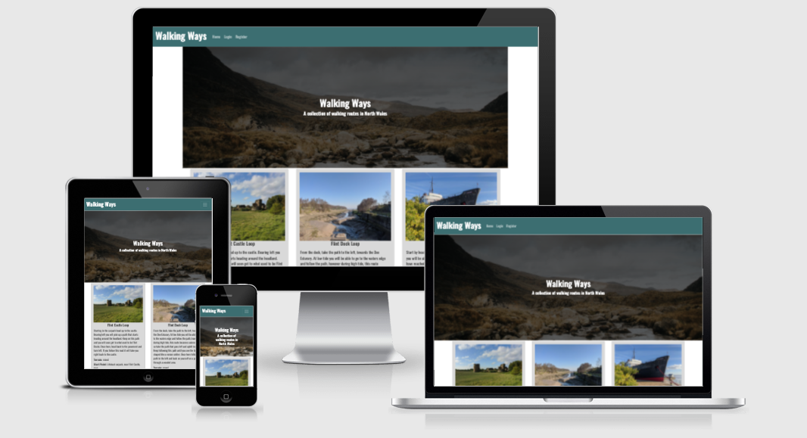

[View the deployed site here](https://walking-routes.herokuapp.com/)

## Table of Contents

- [Project Goals](#project-goals)
- [User Experience](#user-experience)
    - [User Goals](#user-goals)
    - [Target Audience](#target-audience)
    - [User Stories](#user-stories)
    - [User Requirments and Expectations](user-requirements-and-expectations)
    - [Scope](#scope)
    - [Structure](#structure)
- [Design Choices](#design-choices)
    - [Colours](#colours)
    - [Fonts/Typography](#fonts-typography)
    - [Imagery](#imagery)
- [Wireframes](#wireframes)
- [Technologies Used](#technologies-used)
    - [Languages](#languages)
    - [Frameworks, Librabries and Other Tools](#frameworks-libraries-and-other-tools)
- [Features](#features)
- [Future Features](#future-features)
- [Validation and Testing](#vlaidation-and-testing)
    - [HTML Validation](#html-validation)
    - [CSS Validation](#css-validation)
    - [Acessibility](#accessibility)
    - [Performance](#performance)
    - [Testing on Other Devices](#testing-on-other-devices)
    - [Testing of User Stories](#testing-of-user-stories)
- [Bugs](#bugs)
- [Deployment](#deployment)
- [Credits](#credits)
- [Acknowledgements](Acknowledgements)

## Project Goals
The aim of this project is to create a site which enables people to share their favourite walking routes around North Wales. Users will be able to add, edit and delete the routes. 

## User Experience
### User Goals
- An easy to use site
- Add routes quickly and easily
- Find out about new routes
- Keep up to date with any changes to routes on the site.

### Target Audience
- Walkers
- General public interested in getting out walking more
- Dog walkers
- People that are new to the area and would like to find out about walks locally

### User Stories
#### Visitor Goals
1. As a visitor I want the site to be easy and simple to use.
2. As a visitor I want the site to be colourful and eye-catching, as well as be easy to read.
3. As a visitor I would like to be able to add information about new routes easily
4. As a visitor I would like to find out about new routes in my area
5. As a visitor I would like to be able to update routes I have already added to the site
6. As a visitor I would like to be able to delete routes I have previously added to the site
7. As a visitor I would like to be able to see an image from the route

#### Site Owner Goals
8. As a site owner I want the site to be easy to use.
9. As a site owner I want users to be able to view, add, edit and delete routes on the site.
10. As a site owner I want the purpose of the site to be clear to each user.

### User Requirements and Expectations
#### Requirements
- Easy to navigate
- Appealing design
- The user will be able to log in to add a route
- Only the user that added the route origianlly will be able to edit or delete it
- All users will be able to view the routes on the site.

#### Expectations
- Buttons take you to the page they say they will
- The add route form will successfully add a route to the database
- The edit form will successfully edit a route from the database
- The delete button will successfully delete a route from the database
- The user will receive feedback from the site when ading or editing a route and logging off
- Users are able to create an account so they can start adding routes

## Scope
Based on the above information, features to be included in the design include:
- An easy to navigate homepage with an obvious path to other pages
- A profile page that is only accessbile to individual users when they log in
- An add route form which will only be visibale to users when they log in
- Easily log in and logout of the site with the relevant buttons in the navigation bar
- Favicon to help users identify the site in any tabs

## Structure
A responsive site consisitng of 6 pages and two custom error pages. 3 of the pages are only visible when a user creates a profile.

The site will be easy to use across all devices.

## Design Choices
The style of the site will be simple and minimal so it remains easy to navigate and allows people to add and edit routes easily.

### Colours
The colour scheme for this site is meant to be bright and eye catching to the user, however there should still be enough contrast between the colours used so that the site remains easy to read and navigate for longer periods of time.

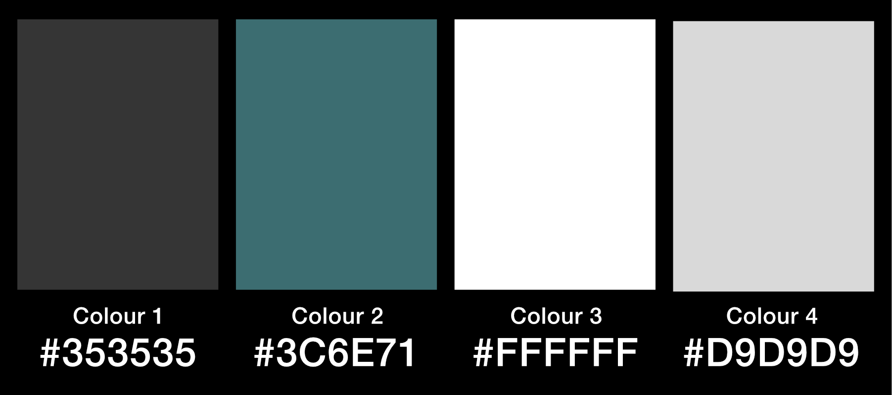

I have chosen a colour scheme that is bright and eye-catching to the user, but it still allows the images added to routes by the user to stand out from the page.
### Fonts/Typography
To ensure the website is easily readable while also keeping to the simple and minimal design, the font I have used is Oswald, taken from the Google Fonts library, with sans-serif being the fallback font should either of the selected fonts be unavailable. 

## Skeleton

## Surface

### Wireframes
- [Index - desktop](docs/wireframes/index-web.pdf)
- [Index - mobile and tablet](docs/wireframes/index-mobile.pdf)
- [Login - desktop](docs/wireframes/login-web.pdf)
- [Login - mobile and tablet](docs/wireframes/login-mobile.pdf)
- [Register - desktop](docs/wireframes/register-web.pdf)
- [Register - mobile and tablet](docs/wireframes/register-mobile.pdf)
- [Profile - desktop](docs/wireframes/profile-web.pdf)
- [Profile - mobile and tablet](docs/wireframes/profile-mobile.pdf)
- [Add and Edit Route - desktop](docs/wireframes/add-edit-web.pdf)
- [Add and Edit Route - mobile and tablet](docs/wireframes/add-edit-mobile.pdf)

## Technologies Used

### Languages
- [HTML5](https://en.wikipedia.org/wiki/HTML5)
- [CSS3](https://en.wikipedia.org/wiki/CSS)
- [Python](https://en.wikipedia.org/wiki/Python_(programming_language))

### Frameworks, Libraries and Other Tools
1. [Affinity Designer](https://affinity.serif.com/en-gb/designer/) was used to create the colour swatch.
2. [Git](https://git-scm.com/) was used within VS Code for version control to push code to GitHub.
3. [Github](https://github.com/) was used as a remote repository to store code.
4. [Am I Responsive](http://ami.responsivedesign.is/) was used to create the mockup you see at the start of this README.md file
5. [Coolors](https://coolors.co/) was used to help put together the colour scheme used throughout the site.
6. [Visual Studio Code](https://visualstudio.microsoft.com/) is the IDE I used to develop the project.
7. [Balsamiq](https://balsamiq.com/) was used to create the wireframes for the site
8. [Font Awesome](https://fontawesome.com/) was used for the icons throughout the site.
9. [Google Fonts](https://fonts.google.com/) Bebas Neue was used for headings, while Montserrat was used for body text.

## Features
#### Feature 1 - Homepage
The homepage is made up of:
1. The navigation bar
2. The hero image and text
3. The cards containing information about the routes
##### 1. Navigation
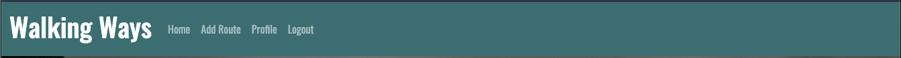
- This is the first thing you see when you get to the site so I decided this needed to be easy to read to allow the user to successfully navigate through the site.
- As I wanted to keep the logo simple I used text only, in a bold, striking font.
- The navigation links are relevant and change depending on if the user is logged in or not.
###### User stories covered by this feautre:
1. As a visitor I want the site to be easy and simple to use.
2. As a visitor I want the site to be colourful and eye-catching, as well as be easy to read.
3. As a visitor I would like to be able to add information about new routes easily
8. As a site owner I want the site to be easy to use.

##### 2. Hero Text and Image
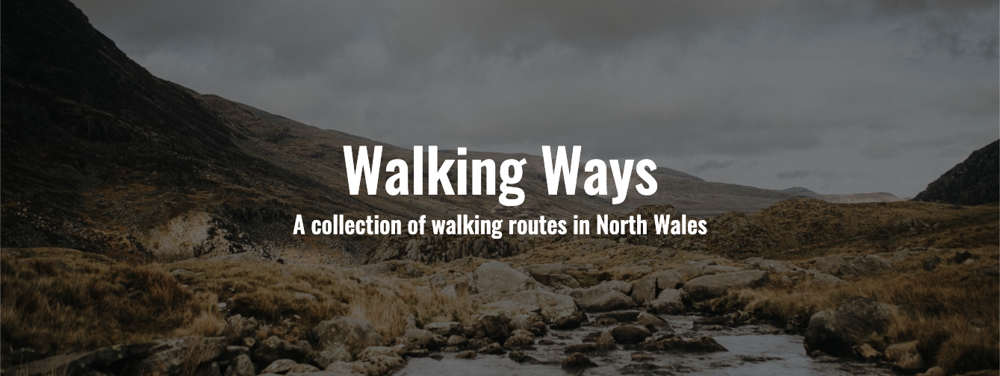
- This feature clearly tells the user what the site is about.
- The text is legible and easy to read due to the shadow added to the image.
###### User stories covered by this feautre:
1. As a visitor I want the site to be easy and simple to use.
2. As a visitor I want the site to be colourful and eye-catching, as well as be easy to read.
10. As a site owner I want the purpose of the site to be clear to each user.

##### 3. Cards containing information about the route
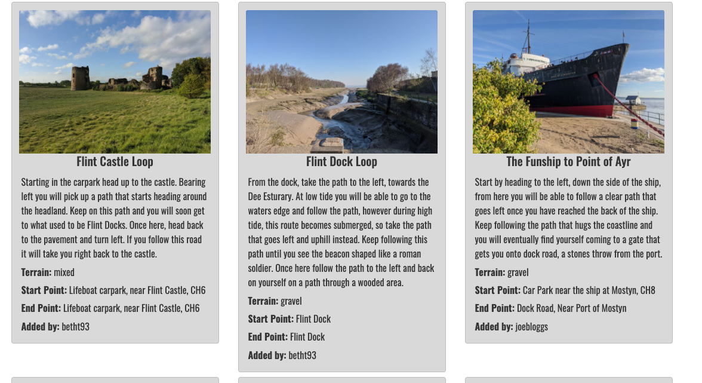
- This is where all the information added by users will be displayed.
- The design means key information, such as the start and end point are clear and easy to find.
###### User stories covered by this feautre:
2. As a visitor I want the site to be colourful and eye-catching, as well as be easy to read.
4. As a visitor I would like to find out about new routes in my area
7. As a visitor I would like to be able to see an image from the route
9. As a site owner I want users to be able to view, add, edit and delete routes on the site.

#### Feature 2 - Login Page
- This page contains a simple form allowing users to log in to the site.
-There is also a link directing users who do not have an acount to register

##### Login Form
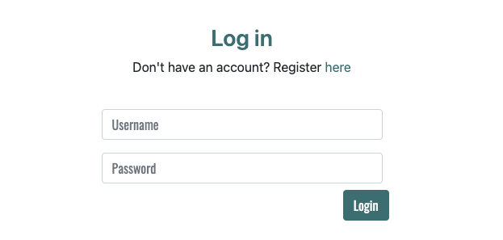
- This lets the user easily login to their account.

###### User stories covered by this feautre:
1. As a visitor I want the site to be easy and simple to use.

#### Feature 3 - Register Page
- This page contains a simple form allowing users to register.
- There is also a link directing users who already have an account to login.

##### Register Form
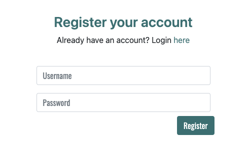
- This lets the user register an account.

###### User stories covered by this feautre:
1. As a visitor I want the site to be easy and simple to use.

#### Feature 4 - Add a Route Page
- This page contains a simple form allowing users to add a route to the site.

##### Add Route Form
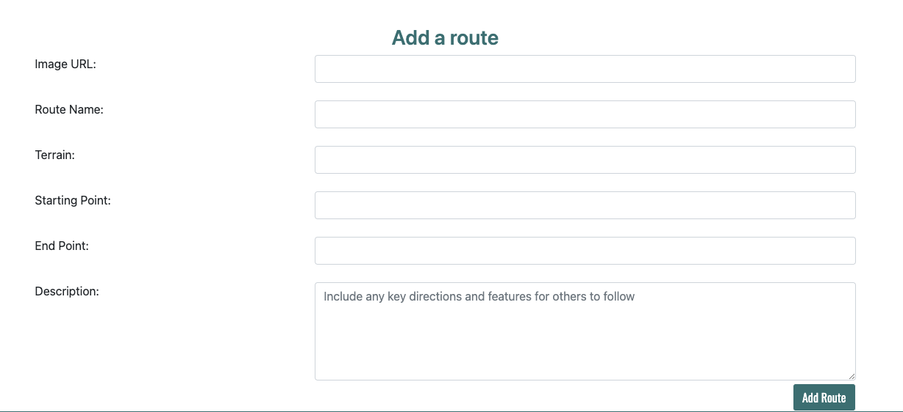
- This lets the easily add a route with all the relevant information to the site.

###### User stories covered by this feautre:
1. As a visitor I want the site to be easy and simple to use.
3. As a visitor I would like to be able to add information about new routes easily
9. As a site owner I want users to be able to view, add, edit and delete routes on the site.

#### Feature 5 - Edit a Route Page
- This page contains a simple form allowing users to edit and exisiting route.

##### Edit Route Form
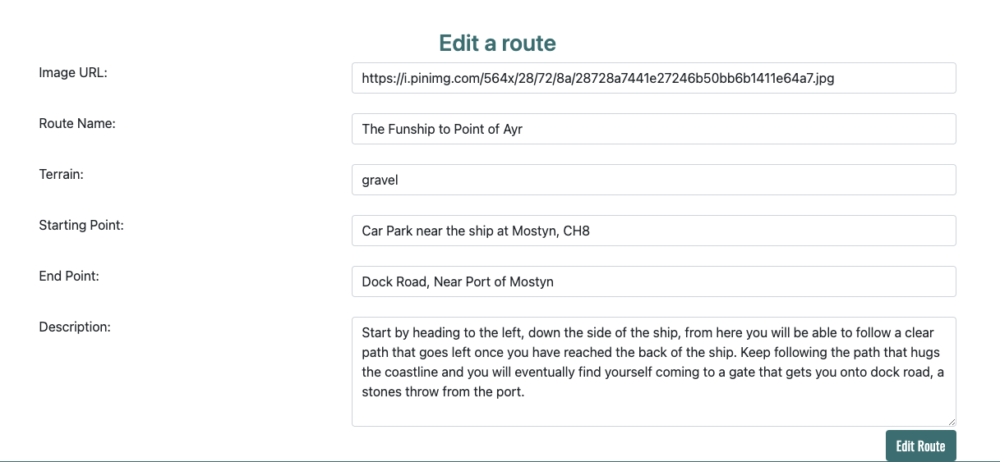
- This lets the easily edit a route they have already added to the site.
- The form is pre-populated with the routes exisiting information.

###### User stories covered by this feautre:
1. As a visitor I want the site to be easy and simple to use.
5. As a visitor I would like to be able to update routes I have already added to the site
9. As a site owner I want users to be able to view, add, edit and delete routes on the site.

#### Feature 6 - Profile Page
- This page contains a breif introduction, informing the user they are on their profile page.
- The page also displays all the routes that the user has added, with the addidition of edit and delete buttons on each card.

##### Introduction

- This lets the user know where they are on the site quickly and easily. It also tells the user what they can do on this page.

###### User stories covered by this feautre:
1. As a visitor I want the site to be easy and simple to use.
10. As a site owner I want the purpose of the site to be clear to each user.

##### Routes
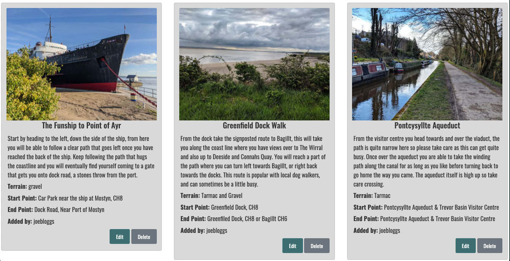
- This allows the user to see the routes they have added with all the details easy to see and read through.

###### User stories covered by this feautre:
1. As a visitor I want the site to be easy and simple to use.
2. As a visitor I want the site to be colourful and eye-catching, as well as be easy to read.
7. As a visitor I would like to be able to see an image from the route

##### Edit and Delete Buttons
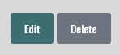
- This allows the user to edit or delete a route from their profile.
- This feature is only accessible if the user is logged in.
- Users can only edit and delete routes they have added themselves.

###### User stories covered by this feautre:
1. As a visitor I want the site to be easy and simple to use.
5. As a visitor I would like to be able to update routes I have already added to the site
6. As a visitor I would like to be able to delete routes I have previously added to the site
9. As a site owner I want users to be able to view, add, edit and delete routes on the site.

## Future Features
In the future I would add the ability to map out each route so users can easily follow a specific route, that is then supported by the instructions given in the route description.

I would also add a feature where users could comment on eachothers routes, creating a community feel on the site.

The area covered would also expand, as the routes on the site are currently all in North Wales.

## Validation and Testing

### HTML Validation
I used the [W3C Markup Validation Service](https://validator.w3.org/) to validate the HTML of the website. All pages passed with 0 errors and 0 warnings.

- [Index](docs/validation/html/index.png)
- [Login](docs/validation/html/login.png)
- [Add a route](docs/validation/html/login.png)
### CSS Validation
I used the [W3C CSS Validation Service](https://jigsaw.w3.org/css-validator/) to validate the CSS of the website.

- [CSS](docs/validation/css/css.png)

### Python Validation
I used [PEP8 online](http://pep8online.com/) and [Extends Class](https://extendsclass.com/python-tester.html) to vaildate the Python of the site

- [PEP8](docs/validation/python/PEP8.png)
- [Extends Class](docs/validation/python/Python-Syntax.png) - Shows 0 syntax errors

### Performance
I used [Google Lighthouse](https://developers.google.com/web/tools/lighthouse) to measure the performance and speed of my website.

- [Index](docs/validation/lighthouse/lighthouse-index.png)
- [Profile](docs/validation/lighthouse/lighthouse-profile.png)

### Testing on other devices

#### Devices tested:
- iPhone 12 Pro
- Samsung Galaxy s20+
- iPad Pro 11"
- 21.5" iMac
- Asus Chromebook Flip C434TA

#### Browser Testing
- Chrome
- Brave (Chromium)
- Safari

#### Tests Performed
- The 'play' button on the homepage successfully takes you to a quiz.
- The social media links on the homepage open to the corresponding site in a new tab.
- The 'back home' button on the score page successfully takes you back to the homepage.
- All pages are repsonsive so the site looks and works the same on all screen sizes
- The Sweet Alert modals on the quiz page work correctly giving the user feedback on their answer.
- All text on the site is clear and legible.
- The score page tells you how many questions you got correct out of the total amount of questions in the quiz.
- The answer options on the quiz page change colour in response to the selected answer being correct or incorrect.
- The answer options transform on hover, allowing the user to see what answer they are hovering over before they select.

#### Results
All devices passed the tests

### Testing User Stories

1. As a visitor I want the site to be easy and simple to use.
    
    | Feature | Action | Expected Result | Actual Result |
    | ------- | ------ | --------------- | ------------- |
    | Simple, easy to use design | User is able to navigate to all parts of the site | User is able to successfully complete the quiz easily | Works as expected |

2. As a visitor I want the site to be colourful and eye-catching, as well as be easy to read.
    
    | Feature | Action | Expected Result | Actual Result |
    | ------- | ------ | --------------- | ------------- |
    | Bright colour scheme that is also still legible | All colours used on the site are bright and colourful, but still allow good legibility | Users find the site eye-catching and have no issues with the sites ease of use | Works as expected |

3. As a visitor I would like to be able to start a quiz quickly

    | Feature | Action | Expected Result | Actual Result |
    | ------- | ------ | --------------- | ------------- |
    | Easy to see play button on the first page as the site loads | User presses the play button | To be taken to the start of a quiz | Works as expected |

4. As a visitor I would like to have feedback on my answers

    | Feature | Action | Expected Result | Actual Result |
    | ------- | ------ | --------------- | ------------- |
    | Sweet Alerts | An alert pops up telling the user if the answer is correct or incorrect, and also tells the user what the correct answer was | User is able to clearly see the result of their answer selection | Works as expected |

5. As a visitor I want to be able to return to the site and not get the same questions every time.

    | Feature | Action | Expected Result | Actual Result |
    | ------- | ------ | --------------- | ------------- |
    | Use of an API to pull questions to the site | The site automatically pulls questions from an API with many questions that is constantly being added to | The user gets a wide variety of questions, no matter how many times they complete the quiz | Works as expected |

6. As a visitor I would like to be able to see my final score

    | Feature | Action | Expected Result | Actual Result |
    | ------- | ------ | --------------- | ------------- |
    | Separate score area at the end of the quiz | When the users completes the quiz a new div appears, showing the score | The user is easily able to see their final score at the end of the questions | Works as expected |

7. As a visitor I would like to keep up to date with any new quiz content via social media.

    | Feature | Action | Expected Result | Actual Result |
    | ------- | ------ | --------------- | ------------- |
    | Social media links on homepage | The user clicks on the relevant logo at the bottom of the page | The page will open in a new tab | Works as expected|

8. As a site owner I want the site to be easy to use.

    | Feature | Action | Expected Result | Actual Result |
    | ------- | ------ | --------------- | ------------- |
    | Simple page design | Easily see which button you need to press to progress through the site | The user can easily navigate the site to start a new quiz | Works as expected |

9. Keep the maintenance of the site as minimal as possible by using an API to source the quiz questions.
10. Ensure there is a variety of questions so users will not get the same set of questions if they play more than once.

    | Feature | Action | Expected Result | Actual Result |
    | ------- | ------ | --------------- | ------------- |
    | Use of an API that has a feature to add questions to it | The API will automatically pull through questions that have been added to the site | The questions on each quiz will change every time a user plays | Works as expected |

## Bugs
- Bug : Quiz questions contained other characters instead of the correct punctuation.
- Fix: Update JavaScript to innerHTML rather than innerText for the question functions.

- Bug: Loading wheel and quiz showing at the same time, quiz and final score showing at the same time and loading wheel preventing all other page content from showing.
- Fix: Check and ensure 'hide' class was active and inactive on the correct elements at the correct time.

- Bug: CSS stylesheets not pulling thorugh to GitHub Pages.
- Fix : Remove error with an extra '/' in the link to the stylesheet.

- Bug: The timeout of the Sweet Alert and the New Question function preventing the user to easily see what the correct answer was should they get the wrong answer.
- Fix: Add in the correct answer number to the Sweet Alert and increase the amount of time before the next question loads.

- Bug: The answer divs becoming too narrow to show answer on smaller screens
- Fix: Add a media query to remove padding from around the edge of the divs to allow them to fill the width of the screen.

- Bug: API data not loading to site.
- Fix: Add fetch statement inside a function.

- Bug: Sidescroll on small screen sizes
- Fix: Remove 100% for width in CSS on the dic for the question counter.

## Deployment
### Github Pages
This site is deployed using GitHub pages, this was the process:
1. Log in and selected my MS2 repository
2. Go to settings in the repository
3. Go to 'Pages" in the menu
4. Click 'source'
5. Change to dropdown menu from 'none' to 'main'
6. Click the link to the deployed site once the page has reloaded

### Forking this Repository
1. Find the repository on GitHub
2. Click the 'Fork' button on the top right of the page
3. You will now have a copy of the repository on your Github account

### Cloning this Repository
1. Find the repository on Github
2. Click on 'Code'
3. To clone using HTTPS - copy the url
4. Open Git and go to the directory you want to become the cloned directory
5. In the terminal type 'git clone' and the url
6. Press enter for the clone to be created.

## Credits
### Content and Media
- The API data was sourced from [Open Trivia Database](https://opentdb.com/api_config.php).
- All other text was written by myself.
- The concept for the logo was my own.

### Code
- [W3 Schools](https://www.w3schools.com/howto/howto_css_loader.asp) to create a loading wheel.
- [Sweet Alert](https://sweetalert2.github.io/) was used to create modals for user feedback on each answer.
- [Open Trivia Database](https://opentdb.com/api_config.php) was used as an API for the quiz questions.

## Acknowledgements